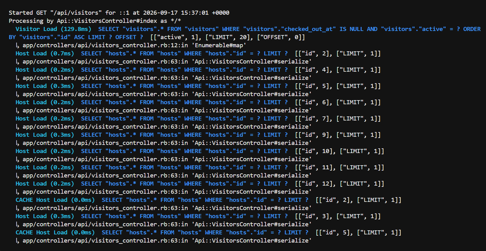
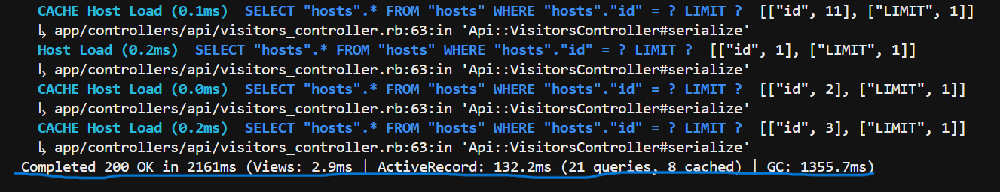
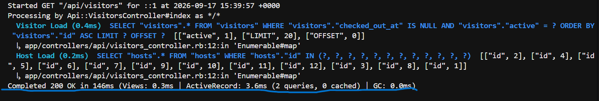

# Backend-notes.md - Pujan Lakhe

## Why I selected Defect 1

**D1: Deactivated visitors still appear in Active Visitor list** 

I selected  this because:

- It is a **data integrity + functional correctness** issue: the “active visitors” endpoint should not return deactivated visitors.
- It can cause real product impact: wrong active counts, incorrect UI display, and confusion for staff/admins.
- The fix is small and safe (query filter), and can be verified clearly with a request spec.

## Fix summary
Updated `GET /api/visitors` to exclude inactive visitors:
```ruby
visitors = Visitor.where(checked_out_at: nil, active: true)
```

## Why I selected Defect 2

**D2: Deactivated visitors returned in search results** 

I selected because:

- It is a functional correctness issue: deactivated visitors should not be
  available as candidates for repeat visits.
- It can cause real product impact by allowing staff to select a visitor record
  that has been intentionally deactivated.
- The fix is small and safe (query filter), and can be verified clearly with a request spec.

## Fix summary

Updated `GET /api/visitors/search` to exclude inactive visitors:

```ruby
visitors = Visitor.where("full_name ILIKE ?", "%#{q}%").where(active: true)
```

## Why I selected Defect 3

**D3: Re-checking out a visitor overwrites the original checked_out_at timestamp** 

I selected because:

- It is a **data integrity issue**: the `checked_out_at` field should represent the exact moment a visitor checked out and should not be modified once set.
- It can cause real product impact: overwriting timestamps leads to  incorrect duration calculations, and compliance/reporting issues.
- The fix is small and safe (conditional check before update), and can be verified clearly with a request spec.

## Fix summary

Updated `PATCH /api/visitors/:id/check_out` to prevent overwriting an existing checkout timestamp:

```ruby
if visitor.checked_out_at.nil?
  visitor.update!(checked_out_at: Time.current)
end
```
## Why I selected Defect 8

**D8: N+1 query problem in visitor list endpoint** 

I selected because:

- It is a **performance issue**: the endpoint executes N+1 database queries (21 queries for 20 visitors) instead of 2 queries, causing unnecessary database load and slower response times.
- It can cause real product impact: degrade performance for visitors viewing the visitor list, increased server load, and poor scalability as the number of visitors grows.
- The fix is small and safe (adding `.includes(:host)`), and can be verified clearly with query log analysis and performance measurements.

## Fix summary

Updated `GET /api/visitors` to preload associated host records:

```ruby
visitors = Visitor.where(active: true, checked_out_at: nil)
                  .order(:id)
                  .includes(:host)
                  .offset((page - 1) * PER_PAGE)
                  .limit(PER_PAGE)
```

## Defect Not Selected And Why

**D4: API responses lack clear success/error messages**

**Why I did not fix this defect:**

- It is more of a **missing requirement** than a functional correctness issue: the specification does not explicitly state that endpoints must return success or descriptive error messages.
- It requires changes to the API response structure, which would alter the existing API contract and could break existing frontend consumers.
- The fix requires product confirmation: response formatting is a design decision, not a technical correction.

**D5: Required full_name and Host field accepts null values**

**Why I did not fix this defect:**

- It is a **data validation issue:** the API allows a visitor to be created with **full_name** and **host_id**set to null, even though full_name is marked as required.
- Fixing it would add backend validation and change the API's behavior for invalid requests.


**D6: Newly added visitors appear at the end of the visitors list**

**Why I did not fix this defect:**

- It is a **usability/UX issue, not a functional correctness issue**: the endpoint works correctly, but the sort order may not match visitor expectations.
- The specification does not explicitly define the expected sort order (newest-first vs. oldest-first), making this more of a **product preference** than a clear defect.
- Changing the default sort order could affect existing consumers that rely on
  the current ordering, so this would require clarification before changing it.
- The fix is simple (add `.order(id: :desc)`), but it requires **product clarification** on whether this is actually the desired behavior before implementing.

**D7: No loading, empty, or error state in visitor list**

**Why I did not fix this defect:**

- It is primarily a **usability issue**: the visitor list does not provide loading, empty, or error states when fetching visitor data.
- The fix belongs to the frontend, not the backend, because these states are related to how the UI handles API requests and displays their results.
- Fixing it in the backend would not directly address the issue and could introduce unnecessary changes to the existing API behavior.
- The frontend should handle loading indicators while the request is in progress, display an appropriate message when no visitors are available, and show an error message when the API request fails.

## Performance Measurements

### Methodology

Performance was measured locally using `GET /api/visitors` before and after the N+1 fix.

For both measurements:

- 20 visitors with associated hosts were used for both tests.
- Rails ActiveRecord SQL logs were used to count database queries.
- Response time was also observed using Postman.
- The main measurement was database query count.

### N+1 Query: `GET /api/visitors`

|                   | Before | After |
| ----------------- | -----: | ----: |
| Visitor queries   |      1 |     1 |
| Host queries      |     20 |     1 |
| **Total queries** | **21** | **2** |

**Before:** Each visitor triggered a separate host query.

**After:** `.includes(:host)` preloads the hosts, reducing the queries from 21
to 2.

### Evidence

**Before — N+1 queries**




**After — Query preloading**

